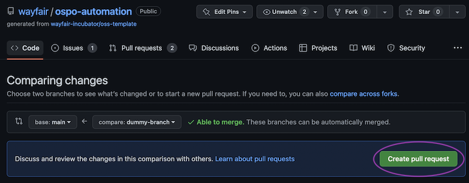
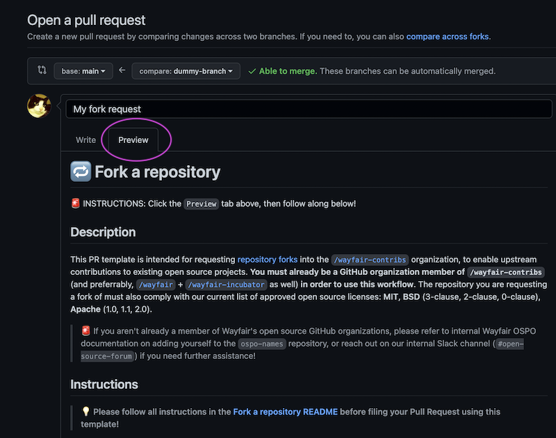
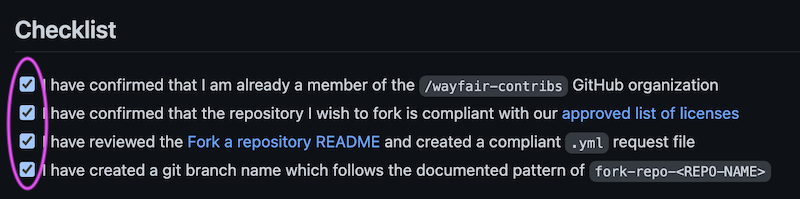
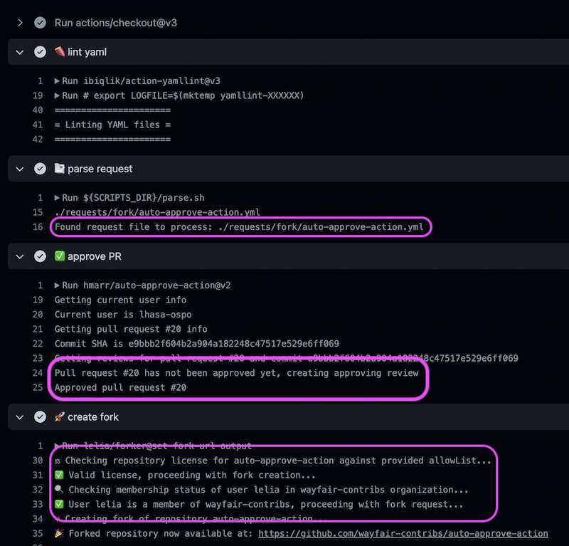
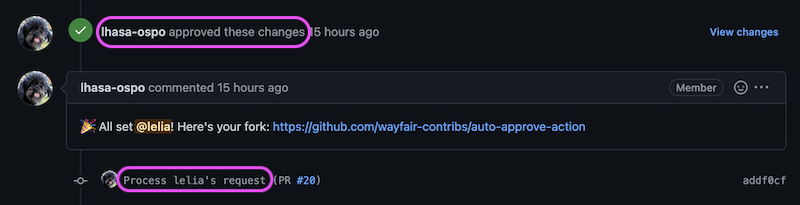

# 🔁 Fork a repository

## Prerequisites

This self-service PR workflow is intended for Wayfair developers requesting [repository forks](https://docs.github.com/en/get-started/quickstart/fork-a-repo) into the [`/wayfair-contribs`](https://github.com/wayfair-contribs) organization, to enable upstream contributions to existing open source projects.

### Organization Membership

**You must already be a member of [Wayfair's](https://github.com/wayfair) [public](https://github.com/wayfair-incubator) [GitHub](https://github.com/wayfair-contribs) organizations in order to use this workflow.** 

> 💡 If you need access, please refer to internal Wayfair OSPO documentation on adding yourself to the `ospo-names` repository, or reach out on our internal Slack channel (`#open-source-forum`) if you need further assistance!

### License Compliance

**The repository you are requesting a fork of must also comply with Wayfair's current list of approved [open source licenses](https://opensource.org/licenses/alphabetical):**

- MIT
- BSD (3-clause, 2-clause, 0-clause)
- Apache (1.0, 1.1, 2.0)

> 💡 If you happen across a project you're eager to contribute to, but are unsure whether it complies with Wayfair's license policy, drop us a line in `#open-source-forum` on Slack!

## Instructions

1. [Clone](https://docs.github.com/en/repositories/creating-and-managing-repositories/cloning-a-repository) this [`ospo-automation`](https://github.com/wayfair/ospo-automation) repository, and create a new branch titled `fork-repo-<REPO-NAME>`, where `<REPO-NAME>` represents the name of the repository you wish to fork.

1. Create a new YAML file (`.yml`) based on the same repository name (eg. `tremor-runtime.yml`) under the `requests/fork/` directory.

1. Using the example below or [linked here](../../wayfair-contribs/tremor-runtime/tremor-runtime.yml), provide the required details in your newly-created YAML file, and commit the changes to your branch:

    ```yaml
    --- # Save this file as: 'requests/fork/<REPO-NAME>.yml'
    github_user: lelia # Your personal GitHub account name (eg. 'lelia' from https://github.com/lelia)
    repo_owner: tremor-rs # The name of the org / account that owns the repository you wish to fork (eg. 'tremor-rs' from https://github.com/tremor-rs)
    repo_name: tremor-runtime # The name of the repository that you wish to fork (eg. 'tremor-runtime' from https://github.com/tremor-rs/tremor-runtime)
    admin_perms: false # Whether or not you require administrator permissions for the repository you are forking (eg. 'true')
    ```

1. Once you've pushed up your changes, you're ready to open a Pull Request using the `Fork a repository` PR template. If you're not sure how to do this, navigate to the [Pull Request](https://github.com/wayfair/ospo-automation/compare) page on [`ospo-automation`](https://github.com/wayfair/ospo-automation) and make sure your branch is selected in the `compare` menu before hitting `Create pull request`:

    

1. This should bring you to the `Fork a repository` template. Before proceeding, click the `Preview` tab (located next to `Write`) to follow the richly-formatted instructions:

    

1. Please ensure you've satisfied all the criteria in the PR Checklist before submitting your Pull Request:

    

1. After submitting the PR, a series of validation checks will run as a GitHub Workflow. If these checks pass, the PR will be auto-approved, allowing the fork request to be automatically processed:

    

1. Once the repository has been forked, the [`lhasa-ospo`](https://github.com/lhasa-ospo) account will comment on the PR with a link, then process the YAML file to a new location for archival purposes.

    

> 💡 If you experience any issues with this workflow, please reach out to [Wayfair OSPO](https://wayfair.github.io) internally on Slack (`#open-source-forum`) and we can lend a hand!
